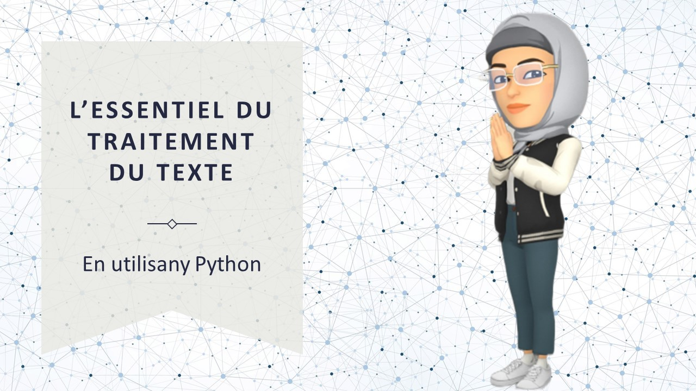

# Traitement-du-texte-Python

## Desctiption
Dans le monde du big data, de plus en plus d'informations sont consommées et analysées sous forme de texte. Les sites Web, les réseaux sociaux, les e-mails et les chats sont devenus les principales sources de données et d'informations. Si vous travaillez avec des données, il est essentiel de comprendre comment traiter les données textuelles non structurées. Dans ce cours, je vous aide à développer vos compétences en matière d'exploration de texte, couvrant les techniques clés d'extraction, de nettoyage et de traitement de texte en Python. Je passe en revue les principaux concepts de traitement de texte tels que la tokenisation et le stemming. On étudie également les techniques de conversion de texte en une forme prête pour l'analyse, notamment les n-grammes et TF-IDF. En cours de route, je vous fournis des exemples de ces techniques en utilisant Python et la bibliothèque NLTK.

## Plan du cours:

1. Introduction au Texte Mining
2. Lire le texte
3. Nettoyage et extraction du texte
4. Traitement du texte avancé
5. Best practices
6. Conclusion
